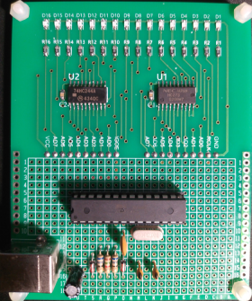
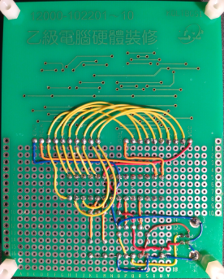
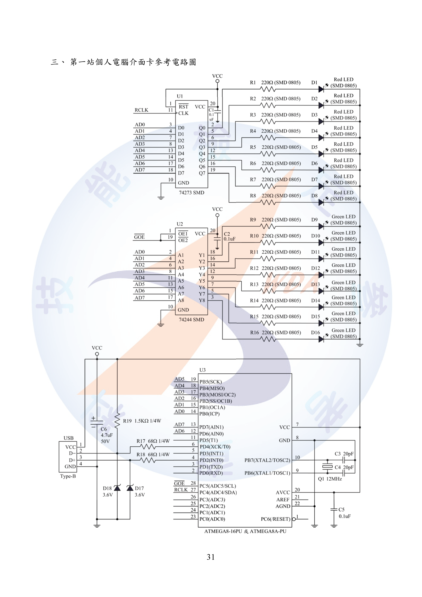
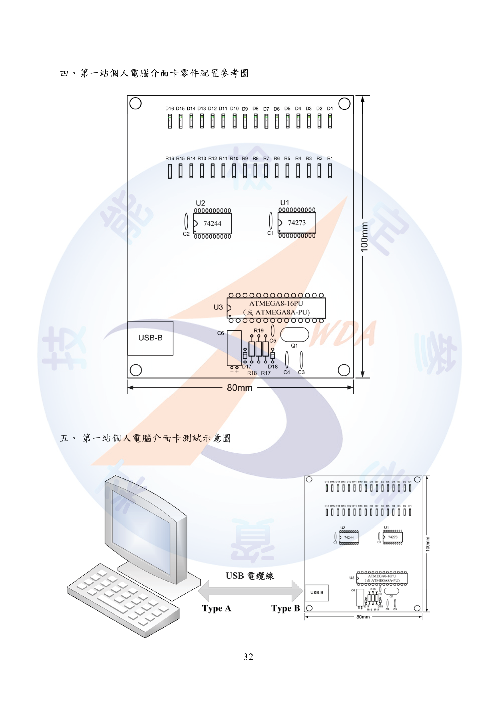
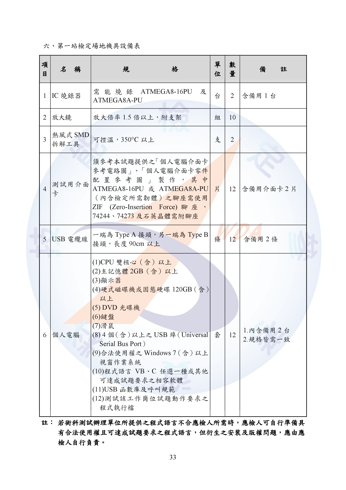
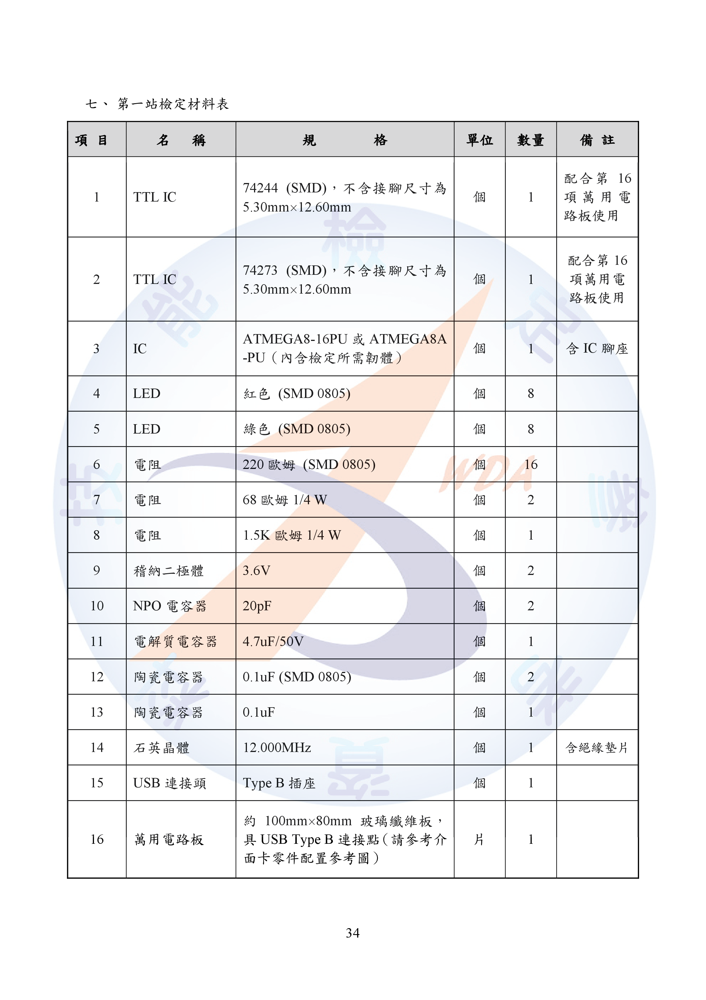
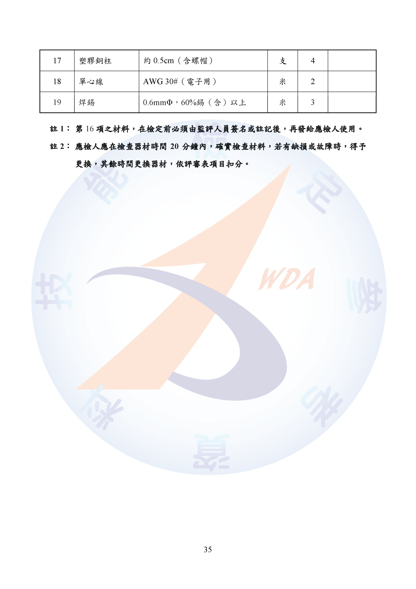

# USB I/O LED 控制器 (v1.5) - 使用說明與注意事項

## 專案簡介

本專案是一個專業級的圖形化介面（GUI）應用程式，使用 Python 語言開發，專門用於控制一款特定的 USB I/O 硬體介面卡上的 16 個 LED。本程式不僅提供基礎的 LED 開關控制，更具備高度穩定性，包含斷線自動重連、狀態恢復、多種快捷操作及現代化的使用者介面，適用於教學、測試、或自動化控制等場景。

USB I/O 硬體介面卡為︰技術士技能檢定電腦硬體裝修職類乙級術科測試應檢參考資料 12000-102201~210 版本



## 主要功能

*   **現代化 UI 介面**：使用 `customtkinter` 函式庫，提供支援 Windows 11 風格的深色/淺色主題。
*   **高穩定性斷線重連**：
    *   程式在背景自動輪詢硬體連接狀態。
    *   無論是程式運行中拔除硬體，或是在程式啟動前未連接硬體，只要將硬體插入 USB，程式便能**自動偵測並恢復連線**。
    *   重連後，程式會**智慧恢復**到斷線前的狀態（無論是普通模式或動畫模式）。
*   **16 個獨立 LED 控制**：每個 LED 對應一個按鈕，可獨立切換開/關。按鈕顏色會隨狀態改變，一目了然。
*   **快捷功能鍵**：
    *   `全部開啟`：一鍵點亮所有 LED。
    *   `全部關閉`：一鍵熄滅所有 LED。
    *   `反向`：一鍵反轉所有 LED 的開關狀態。
*   **動態跑馬燈效果**：
    *   提供從 LED 1 到 16，再從 15 回到 1 的「乒乓來回」跑馬燈效果。
    *   再次點擊「停止跑馬燈」按鈕即可停止。
*   **亂數閃爍效果**：
    *   提供隨機點亮單一 LED 的閃爍效果。
    *   再次點擊「停止亂數閃爍」按鈕即可停止。
*   **可配置的動畫停止行為**：
    *   可透過 `config.py` 設定檔，自由選擇停止動畫時，LED 是**回到動畫前的狀態**還是**凍結在最後一幀畫面**。
*   **單例應用程式**：透過 Windows 系統機制，防止使用者重複開啟多個程式視窗，確保系統中只有一個實例在運行。

## 環境設置與部署指南

這是在一台**全新的 Windows 電腦**上成功運行此應用程式的**最終、最精簡**的步驟。

### 第一步：安裝 32 位元 Python (最關鍵)

由於硬體驅動 `USBIO4.dll` 是 32 位元程式，因此**必須**安裝 32 位元的 Python。

1.  前往 Python 官方網站下載頁面：[https://www.python.org/downloads/windows/](https://www.python.org/downloads/windows/)
2.  尋找適用於 Windows 的最新 Python 版本，並務必選擇標示為 **"Windows installer (32-bit)"** 的安裝程式。
3.  執行安裝程式時，在第一個畫面**務必勾選 `Add Python to PATH`** 選項，然後點擊 `Install Now`。


### 第二步：安裝 Python 函式庫

開啟「命令提示字元 (CMD)」或「PowerShell」，並執行以下兩個指令：

```bash
# 安裝與 Windows COM 元件溝通的函式庫
pip install pywin32

# 安裝現代化 UI 介面函式庫
pip install customtkinter
```

### 第三步：安裝硬體驅動依賴

`USBIO4.dll` 需要特定的系統執行階段函式庫才能運作。

1.  **下載 Microsoft Visual C++ 2010 SP1 可轉散發套件 (x86)**。
    *   **官方下載連結**: [https://www.microsoft.com/zh-tw/download/details.aspx?id=26999](https://www.microsoft.com/zh-tw/download/details.aspx?id=26999)
    *   本專案 `dll` 目錄內附有 `vcredist_x86.exe` , `USBIO4.dll`。
    *   **注意**: 即使您的作業系統是 64 位元，也**必須**安裝 **x86 (32位元)** 版本。
2.  執行下載的 `vcredist_x86.exe` 並完成安裝。
3.  **強烈建議**：安裝完成後，**重新啟動電腦**以確保系統環境完全更新。

### 第四步：註冊硬體 COM 元件

此步驟是為了讓 Windows 系統能夠識別並使用 `USBIO4.dll`。

1.  將 `USBIO4.dll` 檔案放置在一個固定的位置，例如 `C:\` 根目錄。
2.  打開「命令提示字元(CMD)」，務必**點擊右鍵選擇「以系統管理員身分執行」**。
3.  在系統管理員的命令提示字元中，輸入以下指令後按 Enter：
    ```cmd
    regsvr32 C:\USBIO4.DLL
    ```
4.  如果成功，會彈出一個內容為「DllRegisterServer in C:\USBIO4.DLL succeeded.」的訊息。此步驟在每台電腦上只需成功執行一次即可。

### 第五步：執行主程式

1.  請確保以下兩個檔案放置在**同一個資料夾**中：
    ```
    /你的專案資料夾/
    ├── config.py       # 專案設定檔
    └── usbio4.py       # 主程式檔案
    ```
2.  一切準備就緒後，直接執行 `usbio4.py` 即可啟動程式：
    ```bash
    python usbio4.py
    ```

## 使用方法

*   **程式啟動**：
    *   如果硬體已連接，狀態列會顯示綠色的「硬體已連接」。
    *   如果硬體未連接，狀態列會顯示「正在搜尋硬體...」。此時只需將硬體插入 USB 孔，程式便會自動偵測並轉為連接狀態。
*   **LED 控制**：直接點擊 1-16 的數字按鈕即可切換對應 LED 的開關。黃色代表開啟，灰色代表關閉。
*   **快捷操作**：點擊「全部開啟」、「全部關閉」、「反向」按鈕可對所有 LED 進行批次操作。
*   **動畫效果**：
    *   點擊「跑馬燈」或「亂數閃爍」按鈕啟動相應的動畫。
    *   動畫啟動後，按鈕會變為紅色的「停止...」按鈕。再次點擊即可停止動畫，並恢復到動畫前的狀態（或凍結，取決於設定）。
*   **斷線與重連**：在程式運行期間，您可以隨時拔除或插入硬體。程式會自動處理連接狀態的變更，並在重連後恢復所有功能和 LED 狀態。

## 程式客製化 (`config.py`)

您可以透過修改 `config.py` 檔案來自訂程式的外觀與行為，無需更動主程式碼。

*   `UI_THEME`: 更改 UI 主題。可選值為 `"dark"` (深色), `"light"` (淺色), `"system"` (跟隨系統)。
*   `COLOR_...`: 更改 LED 開關、按鈕等元件的顏色。
*   `MARQUEE_SPEED_MS`: 調整跑馬燈的速度（單位為毫秒，數值越小速度越快）。
*   `RANDOM_FLICKER_DELAY_S`: 調整亂數閃爍的間隔（單位為秒）。
*   `RESTORE_STATE_ON_STOP`: **設定停止動畫時的行為**。
    *   設定為 `True` (預設): 停止動畫後，LED 會**恢復到按下動畫按鈕之前的狀態**。
    *   設定為 `False`: 停止動畫後，LED 會**凍結在動畫的最後一個畫面**。

## 注意事項與問題排解

1.  **32位元環境是強制性的**：再次強調，由於 `USBIO4.dll` 的限制，從 Python 到 Visual C++ 套件，都必須使用 32 位元 (x86) 版本，否則程式將無法與硬體通訊。

2.  **管理員權限**：註冊 `USBIO4.dll` 時，必須「以系統管理員身分執行」命令提示字元，否則會出現 `DllRegisterServer failed` 的錯誤。

3.  **硬體無法被偵測**：如果程式一直顯示「正在搜尋硬體...」，請依照以下步驟檢查：
    *   **檢查物理連接**：確認 USB 線是否已牢固地插入電腦和硬體板。可嘗試更換 USB 孔。
    *   **確認驅動依賴**：您是否已安裝 **Microsoft Visual C++ 2010 SP1 可轉散發套件 (x86)** 並且**重新啟動**了電腦？
    *   **確認 DLL 註冊**：您是否已**以系統管理員身分**成功執行了 `regsvr32 C:\USBIO4.DLL` 指令，並看到了成功的提示訊息？
    *   **確認 Python 版本**：在命令提示字元輸入 `python`，檢查啟動訊息中是否包含 `on win32` 字樣，以確認您正在運行的是 32 位元版本。

4.  **程式無法重複開啟**：本程式設計為單一執行個體。如果您嘗試在已有一個程式在運行的情況下再次開啟，新程式會彈出「程式已在執行中...」的提示後自動關閉，這是正常現象。


## 參考資料
[電腦硬體裝修職類乙級術科測試應檢參考資料 PDF檔](./data/120002B12_技術士技能檢定電腦硬體裝修職類乙級術科測試應檢參考資料.pdf)

原理圖


零件配置參考圖


設備表


材料表



